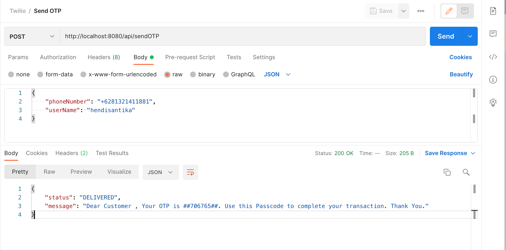
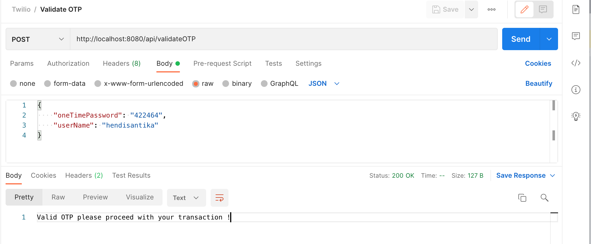

# spring-boot-twilio-sms

### Things todo list:

1. Clone this repository: `git clone https://github.com/hendisantika/spring-boot-twilio-sms.git`
2. Navigate to the folder: `cd spring-boot-twilio-sms`
3. Replace the Twilio Credential with your own in application.properties
4. Run the application: `mvn clean spring-boot:run`
5. Import the POSTMAN Collection

### Image Screen shot

Send OTP



```shell
curl --location --request POST 'http://localhost:8080/api/sendOTP' \
--header 'Content-Type: application/json' \
--data-raw '{
    "phoneNumber": "+6281321411888",
    "userName": "hendisantika"
}'
```

Validate OTP



```shell
curl --location --request POST 'http://localhost:8080/api/validateOTP' \
--header 'Content-Type: application/json' \
--data-raw '{
    "oneTimePassword": "422464",
    "userName": "hendisantika"
}'
```
